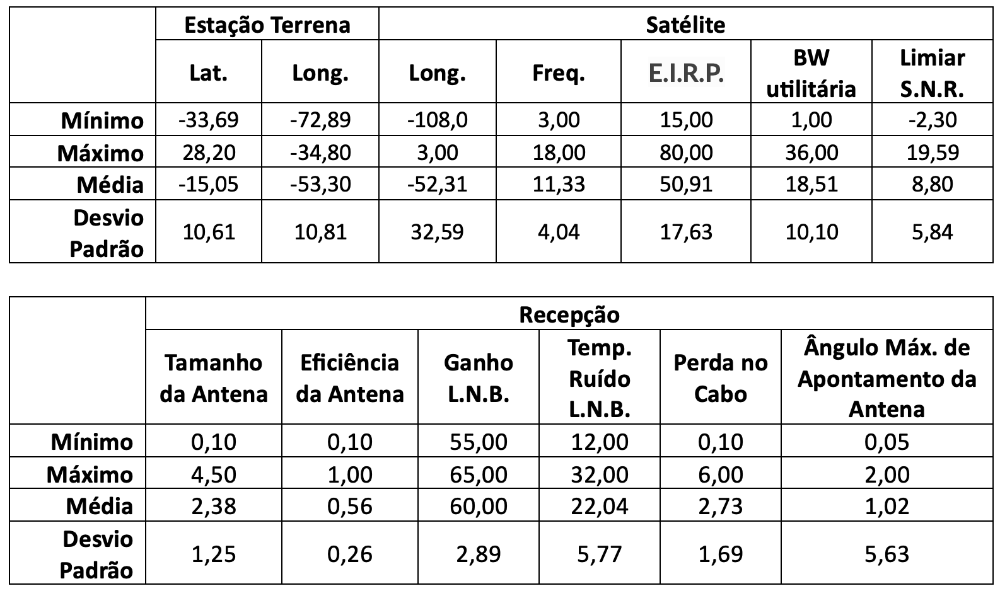
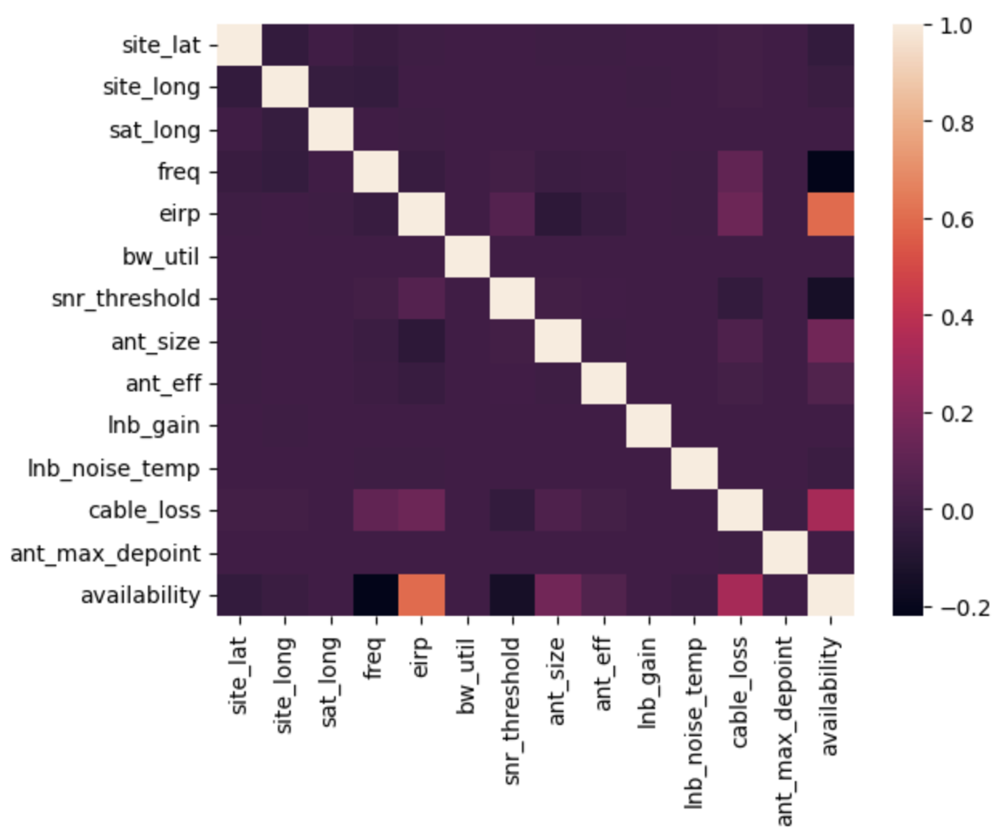
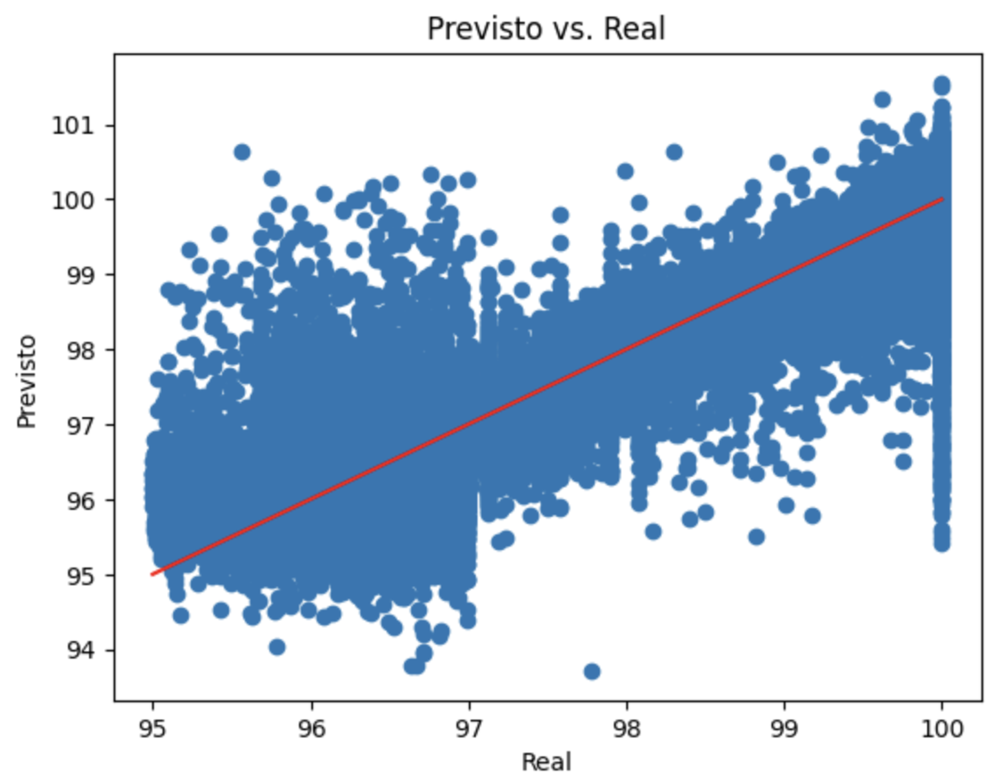
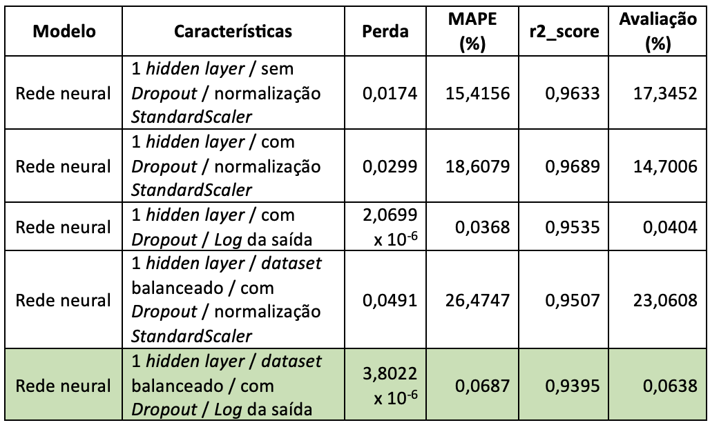
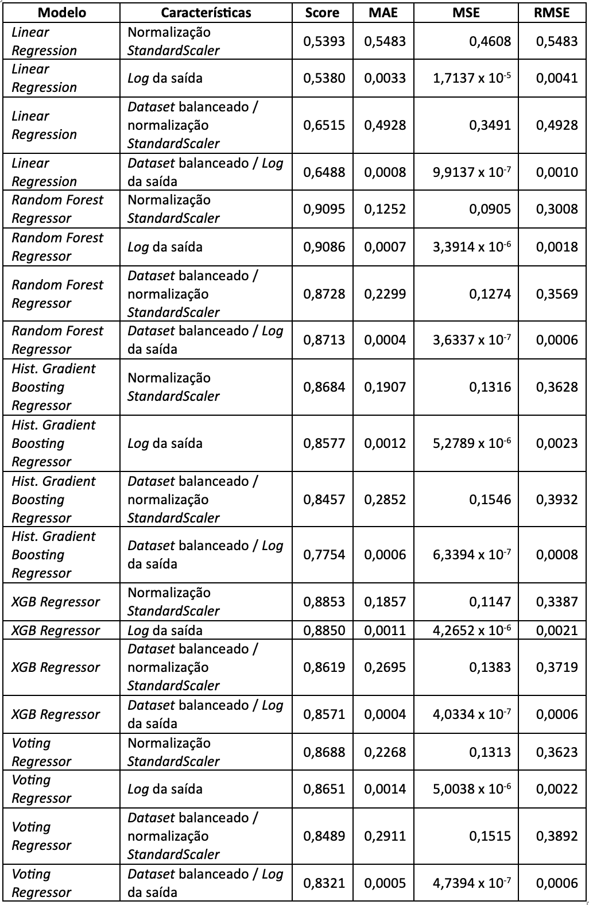
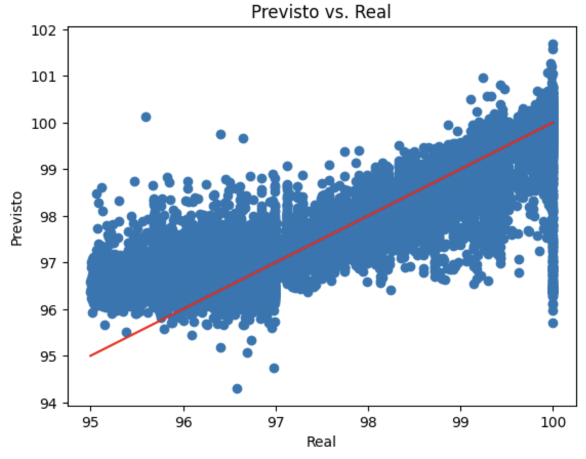

# Otimizando cálculos de disponibilidade de satélites com Inteligência Artificial

## Trabalho Final da Pós-Graduação Business Intelligence Master – 2021.3

### Eleonora Cominato Weiner


Baixar bases de dados em:
1. https://drive.google.com/file/d/1KFxj8DaUDEa_ZmhmJs4qhF7rKGOMuQ7Y/view?usp=drive_link
2. https://drive.google.com/file/d/13rw3ETGNRTkaLTtE82BZg5_eG-uPlPBU/view?usp=drive_link


Este trabalho se baseou no software SatLink, desenvolvido por Christian Rodrigues e disponível no GitHub em https://github.com/cfragoas/SatLink. Este software calcula a disponibilidade do downlink de uma conexão a um satélite e a atenuação atmosférica baseado em dados da estação terrena, do satélite e da recepção. 
Apesar do cálculo não ser exaustivo e já contar com otimização baseada em gradiente descendente e taxa de aprendizado variável, o cálculo pode demorar bastante tempo. Assim, surgiu a ideia de usá-lo para gerar uma base de dados com dados de entrada variados e os devidos resultados de disponibilidade para treinar uma rede neural a ser integrada ao SatLink.
Um script no SatLink foi elaborado para gerar a variação dos dados de entrada e calcular a disponibilidade de cada downlink. A variação foi randômica e uniforme e é apresentada na Tabela 1 abaixo.

Tabela 1 – Variação dos dados de entrada para os cálculos.


Alguns parâmetros de entrada, como rolloff, largura de banda máxima e altura do satélite não foram variados. Já o resultado, a disponibilidade do downlink, apresentou 75% dos dados com valores superiores a 99,64% e 50% dos dados com valores superiores a 99,99%, dificultando em parte o treinamento, como veremos a seguir.
Foram gerados 1.800.000 conjuntos de dados com seus respectivos resultados. Dentre estes, 342.381 geraram figuras de mérito inválidas e precisaram ser filtrados do conjunto de dados. Assim, temos um dataset com o total de 1.457.619 dados com as variações acima detalhadas. A Figura 1 contém a matriz de correlação dos dados de entrada com os resultados dos cálculos.


Figura 1 – Matriz de correlação dos dados de entrada e os resultados dos cálculos.

Como se pode observar, a maioria dos dados de entrada, embora importantes para o cálculo da disponibilidade do downlink do satélite, apresentam baixa correlação com este resultado, salvo pela potência E.I.R.P. (Effective Isotropic Radiated Power), o tamanho e a eficiência da antena e a perda no cabo.
Tanto os dados de entrada e a saída foram normalizados com a função StandardScaler e as duas entradas categóricas relacionadas ao limiar S.N.R (Signal to Noise Ratio), não incluídas na matriz da Figura 1, foram transformadas em numéricas com a função LabelEncoder, ambas do pacote sklearn. O conjunto de dados foi separado em 70% para treino e 30% para teste.
Após alguns testes variados de redes neurais menos complexas, sem hidden layers e sem camadas de Dropout, até redes neurais mais complexas com até três hidden layers e Dropout variado até 0.2, o melhor resultado encontrado foi com a rede neural descrita abaixo, de média-baixa complexidade. Todos os treinamentos foram realizados com 200 épocas.

```
Model: "sequential_1"
_________________________________________________________________
 Layer (type)                Output Shape              Param #   
=================================================================
 dense_3 (Dense)             (None, 512)               9728      
                                                                 
 dense_4 (Dense)             (None, 256)               131328    
                                                                 
 dense_5 (Dense)             (None, 1)                 257       
                                                                 
=================================================================
Total params: 141313 (552.00 KB)
Trainable params: 141313 (552.00 KB)
Non-trainable params: 0 (0.00 Byte)
```
	
Para as duas primeiras camadas, a função de ativação utilizada foi a sigmoid, o otimizador utilizado foi o Adam, a função de perda escolhida foi o erro médio quadrático (MSE) e as métricas utilizadas foram a raiz do erro médio quadrático (RMSE) e o erro percentual absoluto médio (MAPE). Uma perda de 0,0174 e um MAPE de 15,4156% foram atingidos, resultando em um score de 0,9633 no conjunto de teste de acordo com a função r2_score do pacote sklearn. 
Embora este resultado já fosse satisfatório, ao plotar os resultados previstos versus os resultados reais contra a reta f(x)=x, houve resultados longe dos valores esperados, como pode ser observado na Figura 2. 


Figura 2 – Plotagem dos resultados previstos versus reais para o modelo mais simples e com melhor avaliação encontrado. Os dados estão desnormalizados, e a curva f(x) = x nos dá uma indicação de onde os pontos deveriam estar concentrados.

Portanto, alternativas foram testadas para tentar melhorar a predição, dentre os quais:
	o balanceamento dos dados de entrada, diminuindo a quantidade de casos em que o resultado é maior ou igual a 99,5% de disponibilidade para cerca de 167.000 para treinamento (cerca de metade da quantidade de casos com resultado menor que 99,5%). Originalmente, esta quantidade, apenas para o grupo de treinamento, era superior a 850.000;
	a transformação logarítmica dos resultados, no lugar da normalização com StandardScaler;
	a comparação com outros métodos de Inteligência Artificial dos pacotes sklearn e xgboost, como:
	LinearRegression, 
	RandomForestRegressor, 
	HistGradientBoostingRegressor, 
	XGBRegressor, 
	VotingRegressor.
Os resultados encontram-se resumidos na Tabela 2.

Tabela 2 – Resultados dos melhores modelos testados para este trabalho. Outras variações com piores scores e avaliações foram omitidos.



Após avaliar todos os parâmetros de todos os testes realizados, optou-se por escolher o modelo de rede neural com uma camada escondida, dataset balanceado, com Dropout e transformação dos resultados utilizando a função logarítmica para espalhá-los e permitir um melhor treinamento. Com este modelo, o espalhamento dos dados previstos vs. reais foi menor no gráfico, gerando menos outliers, como pode ser visto na Figura 3. O valor de r2_score para este modelo foi o menor dentre os observados, mas este trade off é aceitável, uma vez que o propósito da utilização do modelo no software SatLink é diminuir o tempo de cálculo do software, logo, não seria um problema, por exemplo, ainda utilizar os cálculos já implementados para realizar um ajuste fino no resultado apresentado pelo modelo escolhido. Ainda assim estaríamos trocando um processo de que pode levar dezenas de minutos ou algumas horas por outro que levaria apenas segundos. 


Figura 3 – Plotagem dos resultados previstos versus reais para o modelo escolhido. Os dados estão desnormalizados, e a curva f(x) = x nos dá uma indicação de onde os pontos deveriam estar concentrados. Os pontos azuis neste gráfico estão mais concentrados em torno da curva vermelha f(x) = x.
